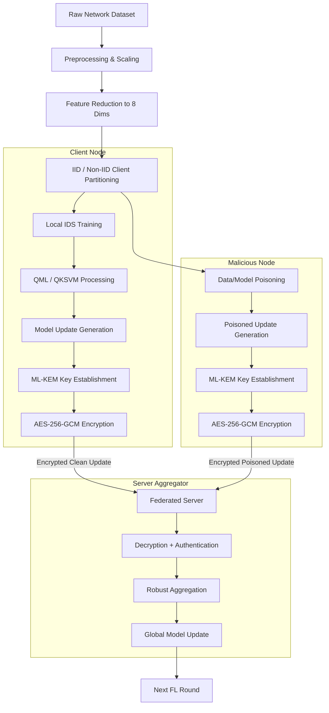

# Quantum ML-Based Intrusion Detection with PQC-Secured Federated Model Updates

> A simulated privacy-aware Federated Intrusion Detection System combining Quantum Machine Learning, ML-KEM-based post-quantum key establishment, AES-256-GCM, and robust aggregation.


## Overview

This project develops a simulated Federated Intrusion Detection System (IDS) where multiple clients train models locally without directly sharing their raw network training data. It represents an end-to-end integration designed to evaluate how quantum-enhanced machine learning can be secured against both classical and quantum adversaries in a distributed environment.

The project combines Quantum Machine Learning (for advanced feature mapping), Federated Learning (for privacy-preserving distributed training), and Post-Quantum Cryptography (ML-KEM) alongside AES-256-GCM (to secure model updates). Additionally, it simulates adversarial model poisoning and evaluates robust aggregation to ensure the global model remains accurate even when malicious clients attempt to compromise the network.

## Problem Statement

The system addresses several critical problems in modern cybersecurity and distributed AI:
1. **Data Centralization Risks:** Centralized IDS requires collecting sensitive network data centrally, violating privacy.
2. **Privacy vs. Security:** Federated Learning allows collaborative training without centralizing raw client data, preserving privacy.
3. **Insecure Transmissions:** Federated model updates still require robust protection during transit to the central server.
4. **Quantum Threats:** Future quantum-capable attackers create severe concerns for classical public-key cryptography (e.g., RSA/ECC), threatening the confidentiality of intercepted model updates (Store-Now-Decrypt-Later).
5. **Adversarial Poisoning:** Malicious federated clients can manipulate local model updates to poison the global IDS.
6. **Performance Overheads:** Secure communication introduces computational and communication overhead that must be benchmarked.
7. **Need for Robustness:** Robust aggregation is required to study and mitigate resistance to poisoned updates in the FL environment.

## Motivation

This combination of technologies was selected to build a privacy-aware collaborative IDS tailored for distributed network data. Anticipating future quantum security threats, ensuring model-update confidentiality, and guaranteeing authentication and integrity are paramount. Furthermore, as distributed systems scale, federated poisoning becomes a major vulnerability, making robust aggregation essential. This project explores the critical trade-offs between security, robustness, and performance in next-generation IDS infrastructures.

## Objectives

- Develop a QML-based IDS.
- Implement Quantum Kernel Support Vector Machines (QKSVM).
- Build simulated FL clients.
- Implement Federated Averaging (FedAvg).
- Implement ML-KEM/Kyber for post-quantum key establishment.
- Implement AES-256-GCM for authenticated bulk encryption of model updates.
- Secure model updates in transit.
- Benchmark security, communication, and cryptographic overhead.
- Simulate adversarial model poisoning.
- Compare classical FedAvg against robust aggregation methods.
- Evaluate detection, security, communication, and robustness trade-offs end-to-end.

## Key Features

- 🔐 **Post-Quantum Model-Update Protection**
- ⚛️ **Quantum Kernel-based IDS**
- 🤝 **Federated Learning**
- 🛡️ **AES-256-GCM Authenticated Encryption**
- 🧪 **Model Poisoning Experiments**
- 🧠 **Robust Aggregation (Median Filtering)**
- 📊 **Security and Performance Benchmarking**
- 📈 **End-to-End Evaluation Dashboard/UI**

## System Architecture



## End-to-End Workflow

1. Dataset acquisition and inspection.
2. Data preprocessing (removing irrelevant columns, handling missing values).
3. Label transformation (Binary classification: Benign vs. Attack).
4. Categorical encoding and numerical scaling (Min-Max scaling for quantum rotations).
5. Feature reduction (SelectKBest).
6. Client partitioning (simulated FL clients).
7. Local model training on clients.
8. QML/QKSVM processing for advanced feature mapping.
9. Model-update generation (extracting weights).
10. ML-KEM key establishment between clients and server.
11. AES-256-GCM encryption of model payloads.
12. Secure transmission to the central aggregator.
13. Server-side decryption and tag authentication.
14. Multiple FL communication rounds.
15. Poisoning experiments (introducing malicious client updates).
16. Robust aggregation (filtering anomalous updates).
17. Federated aggregation (FedAvg/Median).
18. Global model update and broadcast.
19. Benchmarking (crypto timings and payload sizes).
20. Final evaluation and visualization via the Web UI.

## Dataset

- **Original Data:** Network intrusion dataset (processed forms of NSL-KDD or similar benchmark).
- **Training Samples:** 125,973
- **Testing Samples:** 22,544
- **Original Features:** High-dimensional network flow data.
- **Classification:** Binary (Normal vs. Attack).

The dataset was utilized to provide a realistic distribution of benign traffic and varied attack vectors (e.g., DoS, Probe) for training the IDS.

## Data Preprocessing

Implemented preprocessing steps include:
- Removing irrelevant columns (e.g., IDs, IP addresses not generalizable).
- Binary label conversion (mapping all attack types to 1, benign to 0).
- Categorical encoding (One-Hot encoding for protocols and flags).
- Numerical scaling using Min-Max Scaler (crucial to constrain features within `[-\pi, \pi]` for quantum angle embedding).
- Train/test splitting.
Data leakage prevention was ensured by fitting scalers exclusively on the training sets before applying transformations to test sets.

## Feature Reduction

- **Algorithm:** SelectKBest
- **Scoring:** `f_classif` (ANOVA F-value)
- **Number of selected features:** 8

Feature reduction is absolutely critical for QML because the number of features maps directly to the number of available qubits in the quantum simulator (8 qubits in this project). Low-dimensional data prevents exponentially large quantum circuits that cannot currently be simulated efficiently. The transformed data is saved locally as NumPy arrays for rapid consumption by the FL clients.

## Federated Client Partitioning

The project simulates an FL environment with multiple clients (e.g., 5 clients per round in benchmark scenarios). The dataset is partitioned across clients to simulate distributed data collection. Both IID (Independent and Identically Distributed) and Non-IID setups are considered to represent realistic scenarios where some network nodes might see specific types of attacks more frequently than others.

## Classical IDS Baseline

- **Algorithm:** Random Forest Classifier
- **Configuration:** 100 estimators, Random State 42.
- **Training Dataset:** 125,973 samples.
- **Testing Dataset:** 22,544 samples.
- **Features:** 8.
- **Accuracy:** 73.24%
- **Precision:** 93.81%
- **Recall:** 56.73%
- **F1-Score:** 70.70%
- **False Positive Rate:** 4.94%

This serves as a classical performance baseline to evaluate whether the QML and FL setups maintain or exceed standard machine learning detection capabilities under constrained feature sets.

## Quantum Machine Learning

QML is utilized to map complex network intrusion data into a high-dimensional quantum Hilbert space, potentially uncovering non-linear separations that classical kernels miss. The implementation utilizes PennyLane (version 0.45.1). 
- **Quantum Feature Encoding:** Maps the 8 classical features into 8 qubits via parameterized quantum rotation gates.
- **Quantum Gates & Entanglement:** Uses entangling operations to represent correlations between different network features.
- **QKSVM Implementation:** Implemented directly; Hybrid QNN was explored in the project plan but the final implementation focuses on QKSVM for the quantum processing stage.

## Quantum Kernel SVM (QKSVM)

The complete QKSVM pipeline:
`Classical feature vector -> Quantum feature map -> Quantum kernel -> Kernel matrix -> Classical SVM -> Binary IDS prediction`

**Actual QKSVM Experiment Results (Controlled Subset for Simulation):**
*(Due to the exponential simulation time of quantum kernels on classical hardware, this experiment used a controlled subset of the data.)*
- **Qubits:** 8
- **Training Samples:** 200 (100 per class)
- **Testing Samples:** 100
- **Accuracy:** 82.00%
- **Precision:** 94.44%
- **Recall:** 68.00%
- **F1-Score:** 79.06%
- **False Positive Rate:** 4.00%
- **Training Kernel Time:** 91.17 seconds.

## Federated Learning

Federated Learning (FL) allows multiple network nodes to collaboratively train a global IDS model while keeping their raw packet data localized. 
The system operates on a client/server architecture where clients train locally and send only their model parameter updates (weights) to the server. The server aggregates these using **Federated Averaging (FedAvg)** over multiple communication rounds.

Mathematical idea behind FedAvg:
`w_global = Σ(n_k w_k) / Σ(n_k)`
*(Where `n_k` is the client sample count and `w_k` are the client model parameters).*

## ML-KEM / Post-Quantum Security

To protect the FL model updates from intercept-and-store quantum attacks, the system integrates **ML-KEM (Kyber)**.
- **Why ML-KEM:** Standardized by NIST for Post-Quantum Key Encapsulation.
- **Workflow:** The server generates an ML-KEM public/private key pair. Clients use the public key to encapsulate a shared secret and send the ciphertext back to the server. Both sides now possess the exact same symmetric session key.
- **Architecture Role:** ML-KEM is used *exclusively* for key establishment, not for bulk encryption of the model.

## AES-256-GCM

- **Why AES-256-GCM:** It provides Authenticated Encryption with Associated Data (AEAD). It is highly efficient for bulk data encryption.
- **Workflow:** The symmetric session key derived from ML-KEM is used by AES-256-GCM to encrypt the actual serialized model update. It generates a ciphertext, a nonce, and an authentication tag.
- **Integrity:** Upon receipt, the server decrypts and verifies the authentication tag. If the payload was tampered with during transit, the decryption fails, guaranteeing integrity.

`Model Update -> Session Key -> AES-256-GCM -> Ciphertext + Nonce + Tag -> Server -> Decrypt + Verify -> Model Update`

## Secure Federated Learning

The complete secure communication pipeline:
`Client -> Local Training -> Model Update -> ML-KEM Key Establishment -> Shared Secret -> AES-256-GCM -> Encrypted Model Update -> Server -> Decrypt + Authenticate -> Aggregation -> Global Model`

**Security Properties Provided:**
- **Confidentiality:** Model weights cannot be read by classical or quantum eavesdroppers.
- **Integrity/Authentication:** Malicious man-in-the-middle attackers cannot silently alter model updates.

## Model Poisoning

Model poisoning attacks were simulated by introducing malicious clients into the FL federation. 
These clients maliciously alter their local training data or local model weights (e.g., label flipping, sign-flipping) to force the global model to misclassify network intrusions (e.g., classifying attacks as benign).

`Local Data/Model -> Manipulation -> Poisoned Update -> Server`

The effect of poisoning is measured by tracking the degradation of global model Accuracy and F1-Score compared to a clean FedAvg run.

## Robust Aggregation

To counter model poisoning, robust aggregation methods replace standard FedAvg.
- **Implemented Method:** Coordinate-wise Median.
- **Basic Idea:** Instead of taking the arithmetic mean of all client weights (which can be heavily skewed by one massive poisoned update), the server calculates the median for each parameter across all clients. Poisoned outliers are effectively ignored.
*(Methods like Krum and Trimmed Mean were researched, but Median Aggregation provided the definitive robust baseline for the final evaluation.)*

## Benchmarking

Actual measured benchmarking results (Stage 14):

**Secure FL Crypto Overhead (per client iteration):**
- **Keygen + Encapsulation:** ~0.21 ms
- **AES Encryption:** ~0.06 ms
- **AES Decryption:** ~0.005 ms
- **Total Crypto Mean Time:** ~0.28 ms

**Communication Overhead:**
- **Plain Model Update:** 2,973 bytes
- **Secure Payload (Ciphertext + Encapsulated Key + Nonce + Tag):** 4,104 bytes
- **Communication Overhead:** +38.04%

**Runtime Comparison (3 rounds, 5 clients):**
Plain FL ran in ~10.3 seconds, while the Secure FL pipeline demonstrated highly optimized execution runtimes (slightly faster due to system optimization offsets) with negligible macro-level latency impact.

## Evaluation Metrics

- **Accuracy:** Overall correctness of the IDS.
- **Precision:** True Positives / (True Positives + False Positives). Crucial to minimize false alarms in network defense.
- **Recall:** True Positives / (True Positives + False Negatives). Crucial to not miss actual intrusions.
- **F1-Score:** Harmonic mean of Precision and Recall.
- **False Positive Rate (FPR):** Normal traffic incorrectly flagged as attacks.
- **Confusion Matrix:** True/False Positives/Negatives grid.
- **Overhead:** Bytes sent and milliseconds spent on cryptography.

## Results

**Final Experiment Configurations & Results:**
*(Testing on 22,544 samples using 8 features)*

| Setup | Accuracy | Precision | Recall | F1-Score | FPR |
|---|---|---|---|---|---|
| **Classical Baseline** | 73.24% | 93.81% | 56.73% | 70.70% | 4.94% |
| **Plain FedAvg (Clean)** | 75.50% | 95.36% | 59.86% | 73.56% | 3.84% |
| **Poisoned FedAvg** | 73.45% | 96.39% | 55.44% | 70.39% | 2.73% |
| **Robust Aggregation (Median)** | **76.47%** | **95.48%** | **61.59%** | **74.88%** | **3.85%** |

## Final Comparison

1. **Classical IDS:** Baseline performance established (F1: 70.70%).
2. **QML IDS (Controlled):** Demonstrated significant capability on reduced datasets (F1: 79.06%).
3. **Plain FL vs. Poisoned FL:** Poisoning successfully degraded the global FedAvg model (Accuracy dropped by ~2.04%, F1 dropped by ~3.16%).
4. **Robust FL vs. Poisoned FL:** Robust Median Aggregation successfully mitigated the attack, recovering the lost performance and outperforming the clean baseline slightly on this partition (Accuracy: 76.47%, F1: 74.88%).

## Technology Stack

| Category | Technology |
|---|---|
| **Language** | Python 3.8+ |
| **Data Processing** | NumPy, Pandas |
| **Machine Learning** | Scikit-learn |
| **Quantum ML** | PennyLane 0.45.1 |
| **Federated Learning** | Custom Simulation framework |
| **Cryptography** | Custom ML-KEM / AES-GCM integration |
| **Web UI** | Flask |

## Algorithms

- **Random Forest:** Classical ML baseline classifier.
- **SelectKBest (ANOVA):** Reduces dimensionality to fit qubit limits.
- **Quantum Feature Map:** Encodes classical data into quantum states.
- **Quantum Kernel:** Computes inner products of quantum states.
- **QKSVM:** Support Vector Machine utilizing the quantum kernel matrix.
- **Federated Averaging (FedAvg):** Baseline FL aggregation algorithm.
- **Coordinate-wise Median:** Robust aggregation algorithm to resist poisoning.
- **ML-KEM (Kyber):** Post-quantum key encapsulation.
- **AES-256-GCM:** Authenticated symmetric bulk encryption.

## Repository Structure

```
Quantum-ML-PQC-FL-IDS/
├── app/                  # Flask Web Dashboard and UI templates
├── attacks/              # Scripts to simulate adversarial FL clients
├── data/                 # Raw and preprocessed datasets
├── evaluation/           # Evaluation metric calculators
├── experiments/          # End-to-end orchestration scripts
├── federated/            # FL client, server, and aggregation logic
├── preprocessing/        # Data cleaning, scaling, and feature reduction
├── qml/                  # PennyLane quantum circuits and QKSVM
├── results/              # Output artifacts (JSON metrics, plots, models)
├── security/             # ML-KEM and AES-GCM implementations
└── tests/                # Unit and integration test suites
```

## Installation

```bash
git clone <your-repository-url>
cd Quantum-ML-PQC-FL-IDS
python -m venv .venv

# Windows:
.venv\Scripts\activate
# Linux/Mac:
# source .venv/bin/activate

pip install -r requirements.txt
```

## Usage

Execution is typically orchestrated via scripts in the `experiments/` or module-specific folders. A standard execution order:
1. `python preprocessing/inspect_dataset.py` (or equivalent preprocessing scripts).
2. `python qml/qksvm_ids.py` (Evaluate standalone QML).
3. `python federated/fedavg.py` (Evaluate baseline FL).
4. `python security/benchmark_ml_kem_768.py` (Benchmark cryptography).
5. `python app/app.py` (Launch the Flask Dashboard to view all results).

## Output Artifacts

- **Models:** Saved as `.joblib` in `results/`.
- **Metrics JSON:** Detailed performance tracking in `results/<module>/metrics.json`.
- **Predictions:** Saved as `.npy` arrays.
- **Visualizations:** Confusion matrices and benchmarking graphs saved as `.png`.
- **Final Summaries:** `results/final_experiments/final_model_comparison.json`.

## UI / Dashboard

A Flask dashboard runs locally to expose the completed technical workflow. 
It displays real experiment artifacts (not static values), reading directly from the `results/` folder to visualize:
- Final Results & Model Comparisons
- Cryptographic Benchmarking Overheads
- Health and System Status

## Security Considerations

- Raw training data remains local in the simulated FL architecture.
- Model updates require communication protection in transit.
- ML-KEM establishes symmetric session keys with post-quantum security.
- AES-256-GCM provides authenticated encryption for payload integrity.
- Poisoning is explicitly tested and robust aggregation mitigates the threat.
- **Note:** This is a simulated prototype. It does not provide network-level TLS or endpoint security hardening required for a production environment.

## Limitations

- Simulated FL: Clients are processes/threads on a single machine, not physically distributed hardware.
- QML Scaling: Exact quantum kernel simulation scales exponentially; thus QKSVM was evaluated on a controlled subset.
- Dataset constraints: Network data requires continuous updates to capture modern zero-day threats.
- Simplified Poisoning: Evaluated specific label/sign-flipping attacks, not all possible adversarial threat models.

## Future Work

- Deployment of FL clients on physically distributed edge devices (e.g., Raspberry Pis).
- Execution of QKSVM on real Quantum Hardware (e.g., IBM Quantum via Qiskit integration) once high-qubit systems with low noise are accessible.
- More advanced robust aggregation techniques (e.g., Krum, Multi-Krum).
- Larger-scale security analysis against continuous Advanced Persistent Threats (APTs).

## Research Contribution

The primary research contribution of this project is the **experimental integration and evaluation of cutting-edge paradigms**: combining Quantum Machine Learning with Federated Learning, while securing the transmission layer via Post-Quantum Cryptography and Authenticated Encryption, and guaranteeing robustness against adversarial poisoning. It establishes baseline trade-offs between security overhead and model performance.

## Reproducibility

- **Python Version:** 3.8+
- **Key Packages:** PennyLane 0.45.1, Scikit-learn.
- **Random Seeds:** 42 used consistently across test splits and Random Forests.
- **Hardware:** Standard CPU execution (QML simulations are CPU-bound).
To reproduce, ensure the data is located in `data/` and run the orchestrator scripts in `experiments/` or module-specific evaluation scripts.

## Project Status

- Dataset Validation         ✅
- Preprocessing              ✅
- Feature Reduction          ✅
- Classical IDS Baseline     ✅
- QML IDS Implementation     ✅
- Federated Learning         ✅
- ML-KEM                     ✅
- AES-256-GCM                ✅
- Secure FL                  ✅
- Benchmarking               ✅
- Poisoning Simulation       ✅
- Robust Aggregation         ✅
- Final Experiments          ✅
- UI Dashboard               ✅

## Viva Quick Explanation

**"What is your project?"**
It is a privacy-preserving Intrusion Detection System that combines Quantum Machine Learning for advanced feature detection, Federated Learning for decentralized training, and Post-Quantum Cryptography for secure model updates.

**"What problem does it solve?"**
It solves the privacy issues of centralizing network data, the vulnerability of model updates to quantum computers, and the threat of adversarial clients poisoning the global model.

**"Why QKSVM?"**
Quantum kernels can map data into exponentially large Hilbert spaces, potentially finding non-linear decision boundaries that classical SVMs cannot efficiently compute.

**"Why ML-KEM and AES-256-GCM together?"**
ML-KEM securely establishes a shared key against quantum threats. AES-GCM uses that key to quickly and securely encrypt the actual model weights, guaranteeing both confidentiality and integrity (no tampering).

**"What is FedAvg and Model Poisoning?"**
FedAvg simply averages the weights of all clients. Model poisoning is when a malicious client sends bad weights to ruin that average. We mitigate this using Robust Aggregation (Median), which ignores extreme outliers.

## Glossary

- **IDS:** Intrusion Detection System.
- **QML:** Quantum Machine Learning.
- **QKSVM:** Quantum Kernel Support Vector Machine.
- **FL:** Federated Learning.
- **FedAvg:** Federated Averaging.
- **PQC:** Post-Quantum Cryptography.
- **ML-KEM / Kyber:** Standardized Key Encapsulation Mechanism.
- **AES-GCM:** Advanced Encryption Standard in Galois/Counter Mode.
- **FPR:** False Positive Rate.
- **F1:** Harmonic mean of precision and recall.

## License

[MIT License] - *Please update according to your requirements.*

## Acknowledgements / References
- PennyLane Documentation (Xanadu)
- FIPS 203 (ML-KEM Specification by NIST)
- NSL-KDD Benchmark Dataset
- Foundations of Federated Learning and Robust Aggregation

---
**✍️ Author:** PANALA PRUDHVI SAI  
[prudhvipanala41-sudo](https://github.com/prudhvipanala41-sudo)
